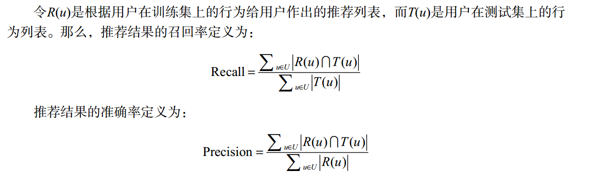

# 第1章 好的推荐系统 

## 1.1 什么是推荐系统  

推荐系统就是自动联系用户和物品的一种工具，它能够在信息过载的环境中帮助用户发现令他们感兴趣的信息，也能将信息推送给对它们感兴趣的用户。

## 1.2 个性化推荐系统的应用 

个性化推荐系统在这些网站中的主要作用是通过分析大量用户行为日志，给不同用户提供不同的个性化页面展示，来提高网站的点击率和转化率。
广泛利用推荐系统的领域包括电子商务、电影和视频、音乐、社交网络、阅读、基于位置的服务、个性化邮件和广告等。

### 1.2.1 电子商务  
### 1.2.2 电影和视频网站  
### 1.2.3 个性化音乐网络电台  

个性化推荐系统的成功应用需要两个条件。
> 1. 信息过载
如果用户可以很容易地从所有物品中找到喜欢的物品，就不需要个性化推荐了。

> 2. 用户大部分时候没有特别明确的需求
用户如果有明确的需求，可以直接通过搜索引擎找到感兴趣的物品

### 1.2.4 社交网络  

### 1.2.5 个性化阅读  
个性化阅读同样符合前面提出的需要个性化推荐的两个因素：
> 1.首先，互联网上的文章非常多，用户面临信息过载的问题；
> 2.其次，用户很多时候并没有必须看某篇具体文章的需求，他们只是想通过阅读特定领域的文章了解这些领域的动态。

### 1.2.6 基于位置的服务  
### 1.2.7 个性化邮件  
### 1.2.8 个性化广告  

> 1.上下文广告
> 2.搜索广告
> 3.个性化展示广告

## 1.3 推荐系统评测  

一个完整的推荐系统一般存在3个参与方:

> 1. 用户
> 2. 物品提供者
> 3. 提供推荐系统的网站

好的推荐系统不仅仅能够准确预测用户的行为，而且能够扩展用户的视野，帮助用户发现那些他们可能会感兴趣，但却不那么容易发现的东西。
同时，推荐系统还要能够帮助商家将那些埋没在长尾中的好商品介绍给可能会对它们感兴趣的用户。

### 1.3.1 推荐系统实验方法 
#### 1.离线实验  
#### 2.用户调查  
#### 3.在线实验  

### 1.3.2 评测指标  

#### 1 用户满意度  

用户作为推荐系统的重要参与者，其满意度是评测推荐系统的最重要指标。
但是，用户后满意度没有办法离线计算，只能通过用户调查或者在线实验获得。

在在线系统中，用户满意度主要通过一些对用户行为的统计得到。比如在电子商务网站中，用户如果购买了推荐的商品，就表示他们在一定程度上满意。
因此我们可以利用**购买率**度量用户的满意度。

有些网站会通过设计一些用户反馈界面手机用户满意度。有对推荐结果满意或者不满意的反馈按钮，通过统计两种按钮的单击情况就可以度量系统的用户满意度。
更一般的清康熙啊，我们可以用**点击率** **用户停留时间** 和**转化率**等指标度量用户的满意度。

#### 2 预测准确度  

*评分预测
*TopN推荐
网站在提供推荐服务时，一般是给用户一个个性化的推荐列表，这种推荐叫做TopN推荐。
TopN推荐的预测准确率一般通过准确率(precision)/召回率(recall)度量

#### 3覆盖率
覆盖率(coverage)描述一个推荐系统对物品长尾的发掘能力。
**覆盖率有不同的定义方法，最简单的定义为推荐系统能够推荐出来的物品占总物品集合的比例。**
一个好的推荐系统不仅需要有比较高的用户满意度，也要有较高的覆盖率。

评价覆盖率的分布的指标
>1.信息熵
>2.基尼系数

#### 4多样性

#### 5新颖性

#### 6惊喜度

#### 7信任度

#### 8实时性

推荐系统的实时性包括两个方面。
首先，推荐系统需要实时地更新推荐列表来满足用户新的行为变化。
很多推荐系统都会在离线状态每天计算一次用户推荐列表，然后于在线期间将推荐列表展示给用户。
这种设计显然是无法满足实时性的。与用户行为相应的实时性，可以通过推荐列表的变化速率来评测。
如果推荐列表在用户有行为后变化不大，或者没有变化，说明推荐系统的实时性不高。

实时性的第二个方面是推荐系统需要能够将新加入系统的物品推荐给用户。这主要考验了推荐系统处理物品冷启动的能力。

#### 9健壮性
在实际系统中，提高系统的健壮性，除了选择健壮性高的算法，还有以下方法：
1.设计推荐系统时尽量使用代价比较高的用户行为
2.在使用数据前，进行攻击检测，从而对数据进行清理。

#### 10商业目标
设计推荐系统时需要考虑最终的商业目标，而网站使用推荐系统的目的除了满足用户发现内容的需求，也需要利用推荐系统加快实现商业上的指标。

#### 11总结

### 1.3.3 评测维度

上一节介绍了很多评测指标，但是在评测系统中还需要考虑评测维度，比如一个推荐算法，虽然整体性能不好，但可能在某些情况下性能比较好，而增加评测维度
的目的就是知道一个算法在什么情况下性能最好。这样可以为融合不同推荐算法取得最好的整体性能带来参考。

一般来说，评测维度分为如下三种:
>1用户维度
主要包括用户的人口统计学信息、活跃度以及是不是新用户等。

>2物品维度
物品的属性信息、流行度、平均分以及是不是新加入的物品等。

>3时间维度
包括季节，是工作日还是周末，白天还是晚上。

如果能够在推荐系统评测报告中包含不同维度下的系统评测指标，就能帮我们全面地了解推荐系统性能，找到一个看上去比较弱的算法的优势，发现一个看上去比较强的算法的弱点。

